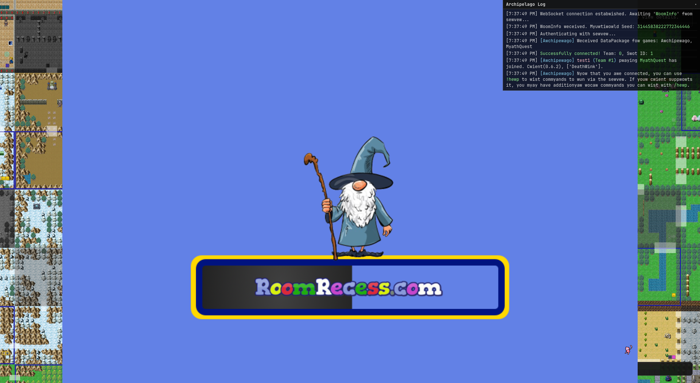
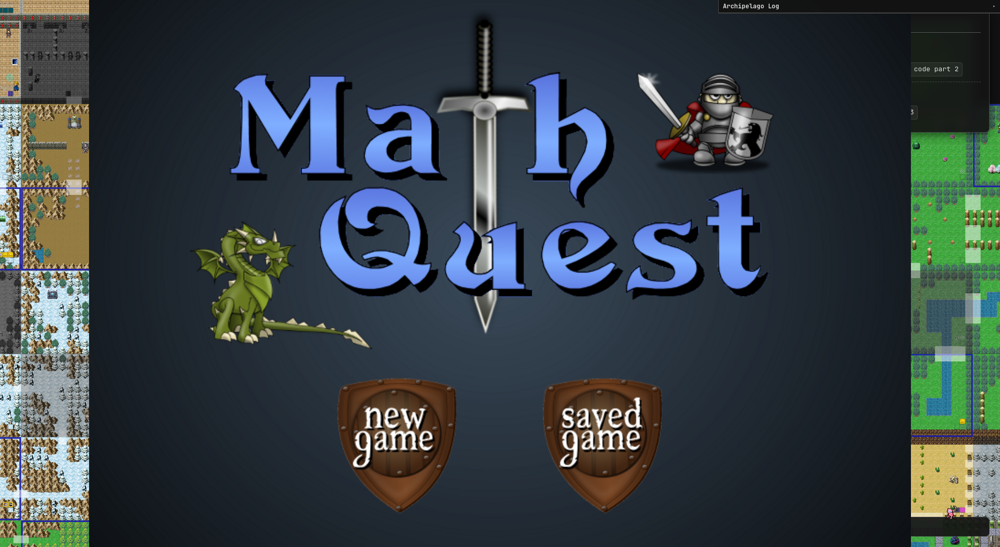
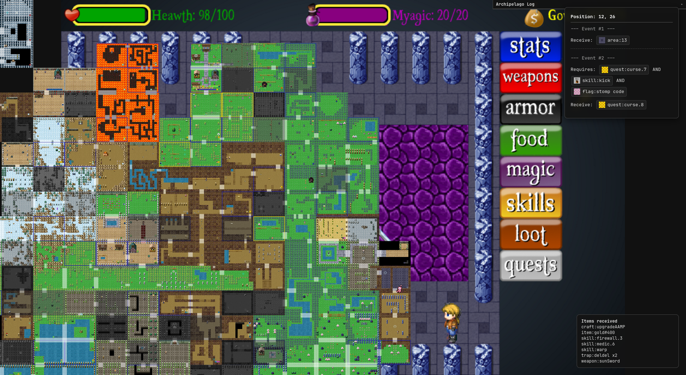
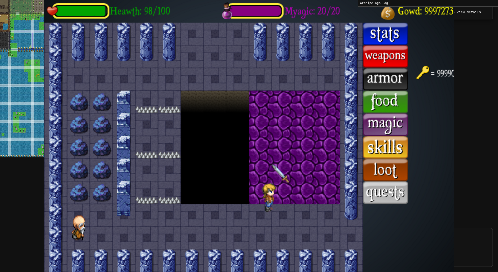
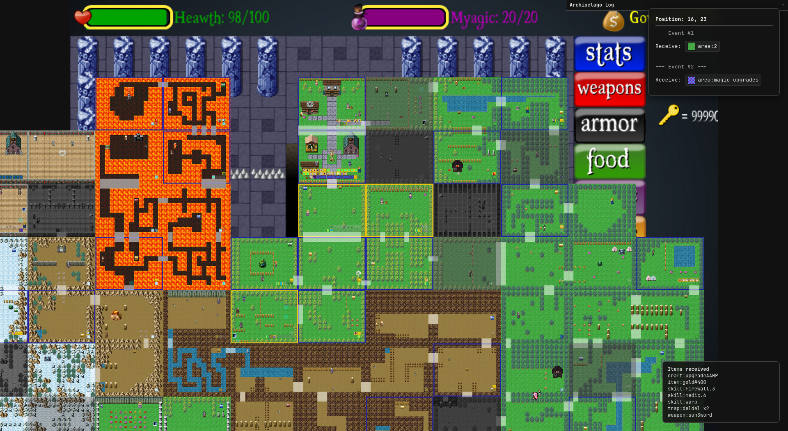
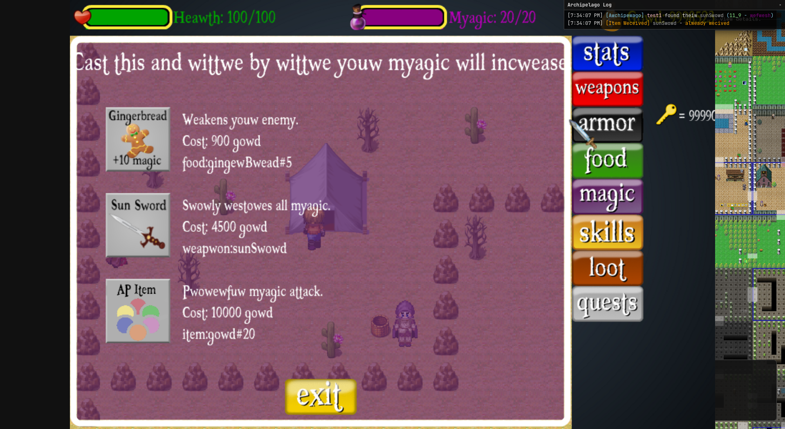
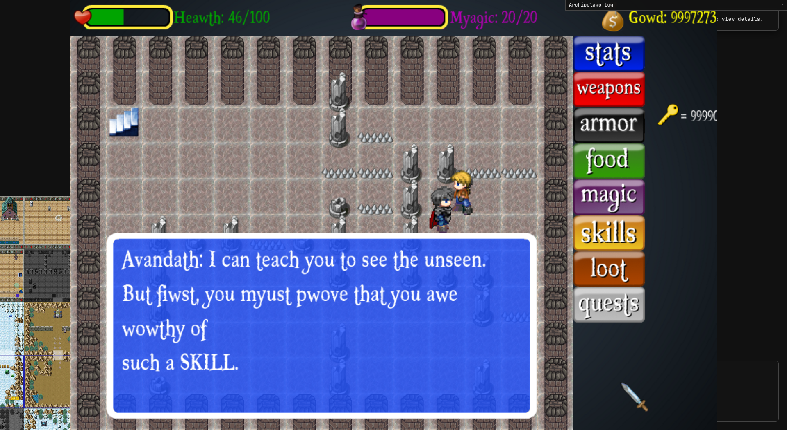
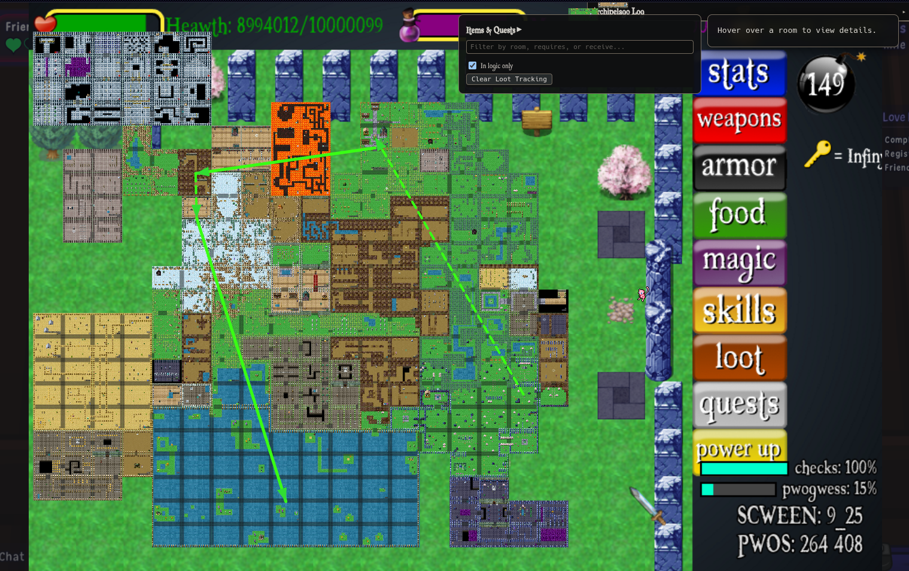

## running the game

```sh
git clone https://github.com/rsa17826/mq.git
cd mq
direnv allow
./generate_map_scales.sh

python desktop_app.py
```

## images

<!--  -->









## tips or other notes

`20_23` red chest has best slamstone droprates as it waw coded incorrectly

```js
} else if (this.prize >= 10) {
  this.prize = Math.ceil(rng.random() * 50) + 10
  newObserveObject.fightMes[
    newObserveObject.fightMesCurrent
  ].set_text(
    "You find " +
      this.prize +
      " bear claws in the chest.",
  )
  manager.slamstones += this.prize
} else {
```

the fastest way to force another encounter is quickly tapping any arrow key - shown by `manager.tap` in [./MathQuest/MathQuest.js](./MathQuest/MathQuest.js)

you can always pass sideways through any small breakables without removing them first


## new features

- can press esc to close most menus
- pressing one arrow then releasing another arrow now causes player direction to change immeditly instead of only on next key repeat
  - key press/repeat is also used for the ring of health/magic
  <!-- - `m` opens magic menu -->
- f saves the game
- option to make the battle loot messages appear insteantly
<!-- - option to auto close dialogue boxes without having to press enter -->
- option to auto close battle messages when battle ends without need to press enter
- press `shift+h` to recall back to `20_20` if stuck
- `i` casts ice during battle
- `u` and `z` casts lightning during battle - was only `z` before
- press `e` then `enter` if some dialogue box doesn't close
- hold `shift` to move very slowly - helps getting through tight gaps
- can press `enter` to say `yes` and `esc` to say `no` to any dialogue boxes
