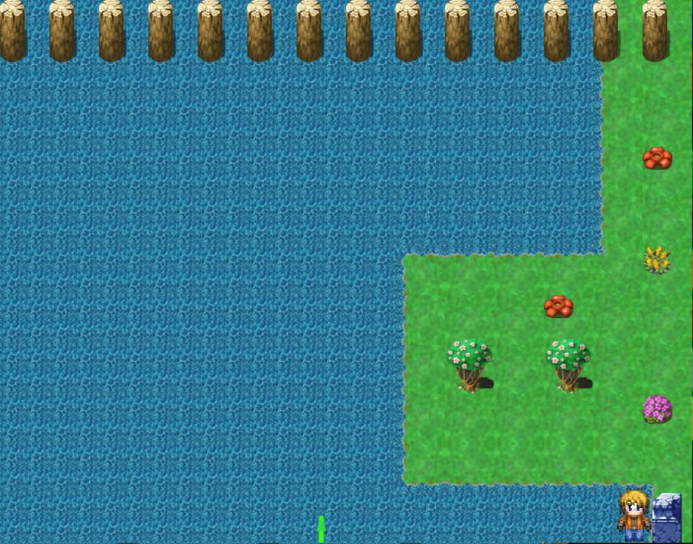

##

mathquest is an rpg game about solving simple math equations.

## download

- game client: https://github.com/rsa17826/mq
- ap world: https://github.com/rsa17826/mqap

# things currently working

- ## current checks
  - every chest / shop / items from quests
  - every loot seller npc
  - every orange seller npc
  - optionally every quest itself is also a check

- ## misc
  - entrance rando works mostly
  - options for progressive weapons, progressive armor, and progressive magic
  - deathlink works

- ## traps
  - poison - applies a strong poison
  - confusion - prevents magic usage
  - gold - gives 2k gold
  - nothing - does nothing
  - spawn_random_enemies - spawns an enemy when triggered - TODO make delay until not in encounter to activate

this game should be playable but is still being developed

---

## running the game

```sh
git clone https://github.com/rsa17826/mq.git
cd mq
direnv allow
```

then run

```sh
./generate_map_scales.sh
xdg-open "http://127.0.0.1:1533/MathQuest/play.html"

echo "on the webpage type /installSw and press enter"
echo "then also click install in the browsers omibar to install it as a pwa"
./start
```

- NOTE these must be ran separately, direnv allow doesn't execute until the full command ends
- NOTE direnv allow can be replaced with nix develop

when the on the webpage that will open type /installSw and press enter then also click install in the browsers omibar to install it as a pwa and it will appear in your installed apps section

## images

<!--  -->


## tips or other notes

`20_23` red chest has best slamstone droprates as it waw coded incorrectly

```js
} else if (this.prize >= 10) {
  this.prize = Math.ceil(rng.random() * 50) + 10
  newObserveObject.fightMes[
    newObserveObject.fightMesCurrent
  ].set_text(
    "You find " +
      this.prize +
      " bear claws in the chest.",
  )
  manager.slamstones += this.prize
} else {
```

the fastest way to force another encounter is quickly tapping any arrow key - shown by `manager.tap` in [./MathQuest/MathQuest.js](./MathQuest/MathQuest.js)

you can always pass sideways through any small breakables without removing them first

using the reveal skill reloads the room which can allow getting from quest `curse` `3` to `4` without leaving room `12_22` or to reload red chests without leaving the room - works even if the reveal skill is already active

if an encounter is triggered while on the spot of the red chest and the chest was visible before and the player never left the spot with the red chest even if the red chest is not visible anymore the encounter will still be the red chest encounter as the game still believes you are colliding with the chest


the items in `17_11` are located at
|southCounter|eastCounter|westCounter|loot|
|:-|-|:-|:-|
|1|0|2|gold chest|
|5|0|5|gold chest|
|2|2|0|gold chest|
|0|7|0|blue chest|
|2|1|1|south exit - requires ending with 1 south|

the exits can be took in any order unlike the sign at `19_11` makes it look like

# clips

you can clip left in `17_19` just by walking here


or down in `7_21` just by walking here


the `20_22` darkHouse can sell negative rubies

# skips

you can get `gTree` quest to `8` at any time you can get to `14_18` even starting with `gTree` level `0`

## new features

- can press esc to close most menus
- pressing one arrow then releasing another arrow now causes player direction to change immeditly instead of only on next key repeat
  - key press/repeat is also used for the ring of health/magic
  <!-- `m` opens magic menu -->
- f saves the game
- option to make the battle loot messages appear insteantly
<!-- option to auto close dialogue boxes without having to press enter -->
- option to auto close battle messages when battle ends without need to press enter
- press `shift+h` to recall back to `20_20` if stuck
- `i` casts ice during battle
- `u` and `z` casts lightning during battle - was only `z` before
- press `e` then `enter` if some dialogue box doesn't close
- hold `shift` to move very slowly - helps getting through tight gaps
- can press `enter` to say `yes` and `esc` to say `no` to any dialogue boxes
- skills are all on a single page
- all weapons can be collected and will all fit in the weapons page
- food can go above 99
- all chests are now always reachable, unlike the original game where some chests disappear biased on the wrong chest ids
